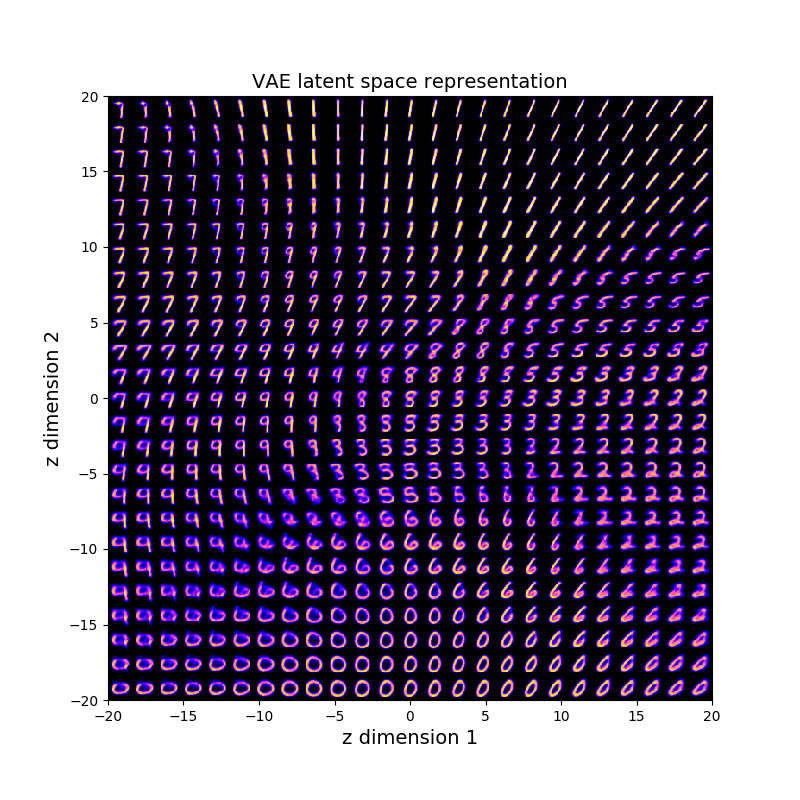

# Variational Auto Encoder - PyTorch
[PyTorch](https://github.com/pytorch/pytorch) Variationnal Auto Encoder implementation as a coding / understanding exercise - with latent space representation.  
Based on paper : https://arxiv.org/abs/1312.6114  
Great ressources to dive deeper in the subject : 
* https://arxiv.org/abs/1606.05908  
* [VI, VAE and Helmholtz Machines](http://artem.sobolev.name/posts/2016-07-11-neural-variational-inference-variational-autoencoders-and-Helmholtz-machines.html)

Implementation details :
* Encoder network has 2 hidden layers of size 200 with ReLU activations
* Decoder network has 2 hidden layers of size 200 with Relu activations
  * Output layer is obtained via sigmoid (Bernoulli MLP case)
* Prior z ~ N(0,I)
As noticed by PyTorch team, ReLU activations make training faster than original proposed tanh.
* Module gen_plot can construct a grid representation of evenly spaced sampling of latent space (latent_dim has to be 2)

## 2-dimensional latent space representation

